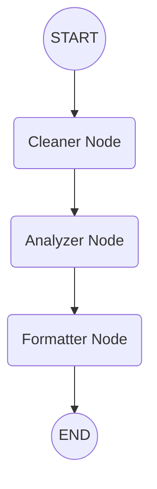

# LangGraph Deterministic Text Pipeline

Welcome to the LangGraph Text Pipeline project! This repository serves as a practical introduction to [LangGraph](https://langchain-ai.github.io/langgraph/), demonstrating how to build a stateful, deterministic, multi-step AI workflow using nodes, edges, and state management.

## 🌟 Overview

The goal of this project is to showcase the fundamentals of LangGraph by building a pure Python Text Processing Pipeline with zero external dependencies. It demonstrates:
- **State**: How to pass a dictionary holding `raw_input`, `cleaned_text`, `word_count`, and `final_status` between steps.
- **Nodes**: How to define functional steps (`cleaner`, `analyzer`, `formatter`) that act as sequential workers.
- **Edges**: How to enforce a linear control flow for deterministic execution.

## 🚀 How to Run

### Prerequisites
Make sure you have Python installed. You'll also need the `langgraph` package.

Install the required dependency:
```bash
pip install langgraph
```

### Execution
Run the workflow script from your terminal:
```bash
python text_pipeline.py
```
You will see the console output stream the state mutations as the string data is cleaned, analyzed, and formatted!

## 🗺️ Workflow Architecture

Here is a visual representation of how the data flows through our pipeline:



## 🧠 Codebase Walkthrough

- **`TextProcessingState`**: A `TypedDict` that defines our pipeline's memory. It manages the evolution of the text data.
- **`cleaner_node`**: Receives raw text, strips whitespace, converts it to lowercase, and saves it to `cleaned_text`.
- **`analyzer_node`**: Reads the cleaned text, calculates the total word count, and saves it to `word_count`.
- **`formatter_node`**: Generates a final summary string using the word count and saves it to `final_status`.
- **`workflow = StateGraph(TextProcessingState)`**: Initializes our deterministic graph.
- **`workflow.add_node()` and `workflow.add_edge()`**: Registers the workers and locks them into a strict linear sequence from `START` to `END`.
- **`app.stream()`**: Runs the compiled graph. Streaming allows us to observe the instantaneous mutations added to the state dictionary after every single node execution.

## 💡 LangGraph vs. LangChain
While **LangChain** is excellent for LLM-driven linear pipelines (chains), **LangGraph** enables you to model your logic as a directed graph. In this text pipeline, we used it for a simple sequence, but this architecture natively supports cyclic flows (loops) where agents can evaluate conditions and route data dynamically until a final goal is met.

---
*Built for learning and exploring the foundational architecture of AI workflows.*
